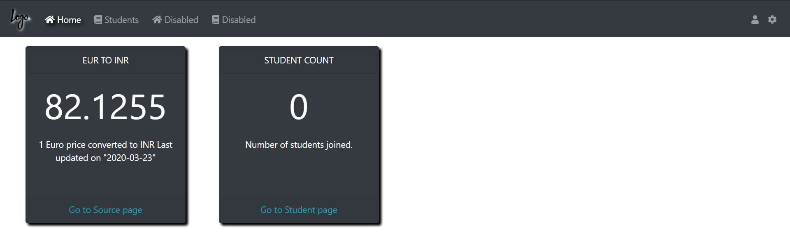
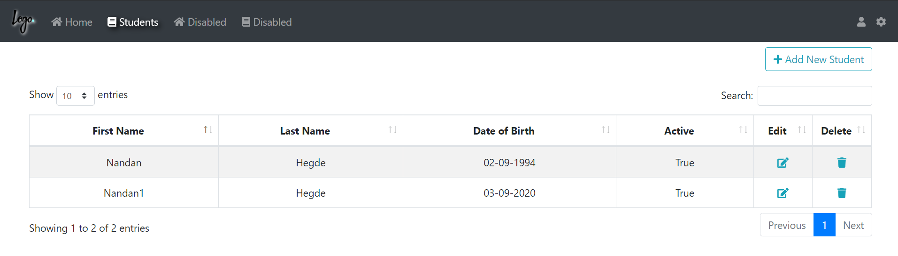
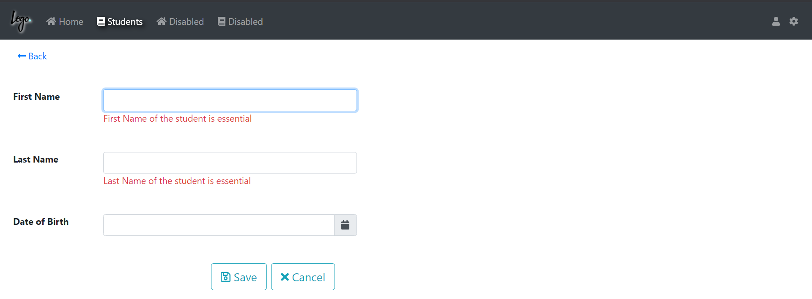
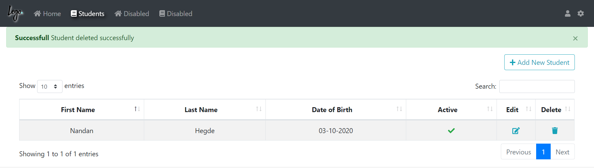

# .Net core 2.1 MVC demo application

## An application developed in ASP.Net core MVC with Razor views, Bootstrap and jQuery. 

#### Application includes demonstration of basic CRUD functionalities using a Student class. 
#### A Home page with 2 cards. One with external api for currency conversion and another showing the number of students available.
#### All the views are built with bootstrap framework and some pure css. 
###### Home page is built with a proper Layout page having Nav-Bar as a view component and 2 cards.
```
<vc:Nav-Bar></vc:Nav-Bar>
```
###### Active menu is handled based on current location of URL.


##### A basic CRUD operation is developed in Students section
##### Entity framework core is used as ORM and developed with repository pattern, where a generic repository is created and inherited from other repositories.
##### The below page shows the list of students in a jQuery Datatable with Edit and Delete buttons inside the table.


##### Adding new students is built with model validation 


##### Status messages created  so as to use like a Enxtension methodes. 
##### Example: 
```
return RedirectToAction(nameof(Index)).WithSuccess("Successfull", "Student deleted successfully");
```
