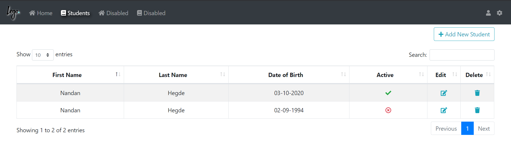

# .Net core 2.1 MVC demo application

## An application developed in ASP.Net core MVC with Razor views, Bootstrap and jQuery. 

#### Application includes demonstration of basic CRUD functionalities using a Student class. 
#### A Home page with 2 cards. One with external api for currency conversion and another showing the number of students available.

##### Home page is built with a proper Layout page having 2 cards.
##### Active menu is handled based on current location of URL. 

##### A basic CRUD operation is developed in Students section

